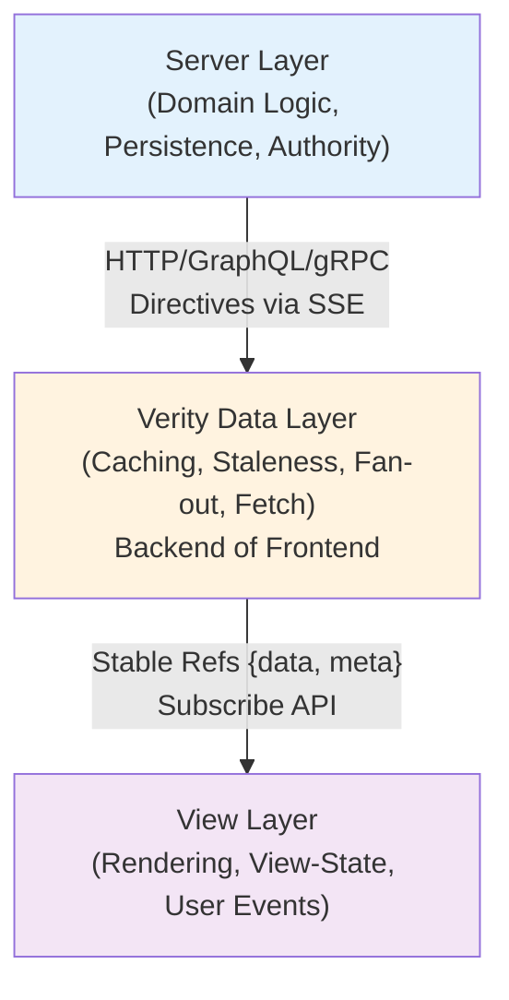

# Architecture: The Backend of the Frontend

Verity positions itself as **the backend of your frontend**—a dedicated data layer that sits between your server and view layer. This section explains the three-layer architecture, data flow, and where different kinds of logic live.

---

## The Three Layers



### Layer 1: Server
**Responsibilities:**
- Domain logic and business rules
- Data persistence and integrity
- Authorization and authentication
- Emitting directives after mutations

**What it does NOT do:**
- Know which components are mounted
- Track client-side UI state
- Send HTML or DOM patches

### Layer 2: Verity (Backend of Frontend)
**Responsibilities:**
- Fetch orchestration (pull)
- Directive processing (push)
- Cache management and staleness tracking
- Concurrency control (latest-wins, coalescing)
- Multi-client convergence
- Level planning and conversion graphs

**What it does NOT do:**
- Render UI
- Manage view-state (menus, focus, modals)
- Perform optimistic updates

### Layer 3: View
**Responsibilities:**
- Render truth-state from Verity refs
- Manage local view-state
- Capture user events and trigger mutations
- Display loading affordances (skeletons, spinners)

**What it does NOT do:**
- Fetch data directly
- Manage truth-state cache
- Coordinate invalidation

---

## Separation of Concerns

### Truth-State Lives in Verity
**Truth-state** is server-owned data that multiple clients must agree on:
- User records
- Order status
- Inventory counts
- Permissions

Verity owns the cache, staleness rules, and synchronization protocol. Views consume stable references.

### View-State Lives in the View Layer
**View-state** is local, ephemeral UI concerns:
- Which menu is open
- Which row is expanded
- Form draft values
- Current tab index

This state never leaves the client and never triggers server invalidation.

**Example:**
```javascript
// ✅ GOOD: Truth-state in Verity, view-state in Alpine
<div x-data="{ 
  get invoices() { return $store.verity.collection('invoices') }, // truth-state
  expandedRow: null // view-state
}">
  <template x-for="invoice in invoices.items">
    <tr @click="expandedRow = invoice.id">
      <!-- render truth-state -->
    </tr>
  </template>
</div>

// ❌ BAD: Mixing truth-state and view-state in one store
const store = {
  invoices: [], // truth-state
  expandedRow: null, // view-state
  selectedFilter: 'all', // view-state
  // This becomes a bug factory
}
```

---

## Next Steps

- [Data Flow](data-flow.md) - Understand pull and push paths
- [Multi-Client Sync](multi-client-sync.md) - Learn about directive fan-out
- [Logic Placement](logic-placement.md) - Where different kinds of logic live
- [Transport Options](transport-options.md) - SSE, WebSocket, and GraphQL subscriptions
