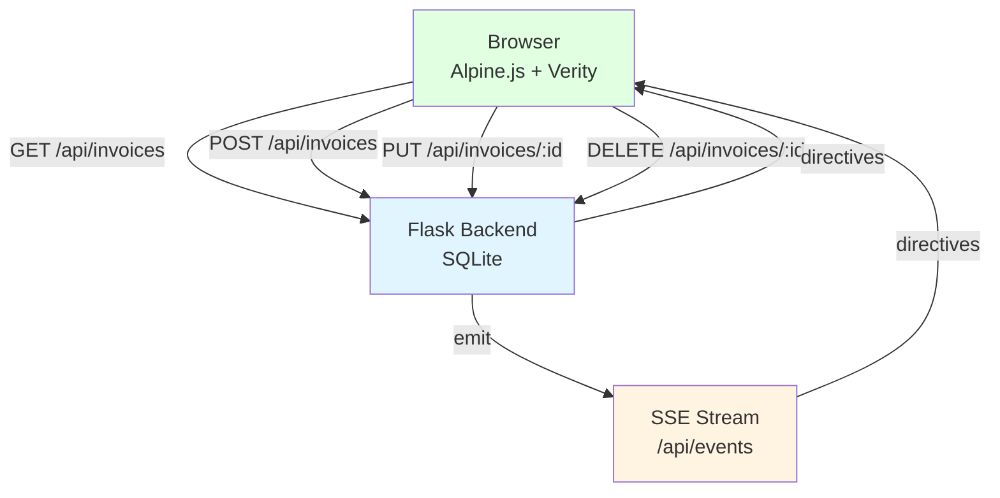
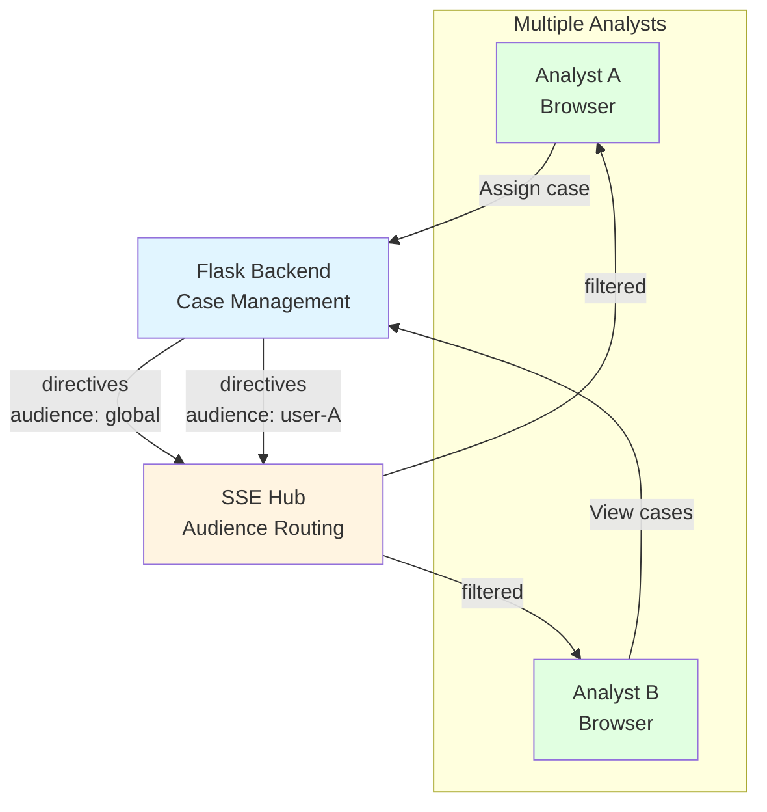
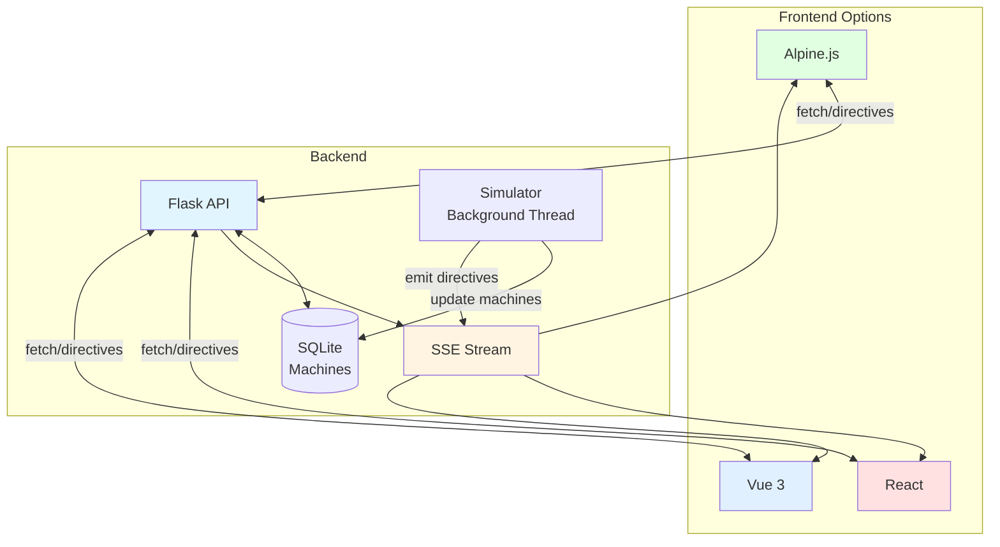
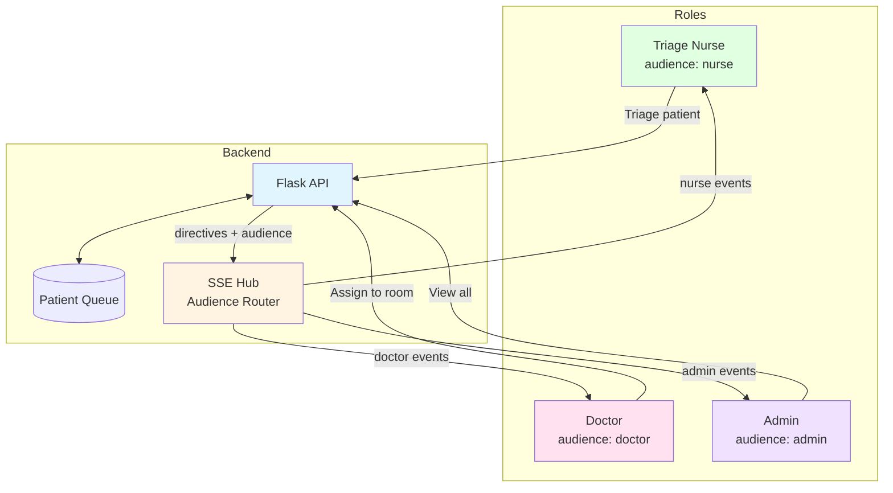

# Examples

> Production-scale reference applications demonstrating Verity patterns

The `verity/examples/` directory contains **full-stack applications** that showcase Verity in realistic domains. Each example includes a **baseline version** that implements the same functionality without Verity, allowing direct comparison.

---

## Quick Start

Run any example locally:

```bash
# Setup
python -m venv .venv
source .venv/bin/activate
pip install -r requirements.txt

# Run an example
python verity/examples/invoices_alpine/app.py
# Then open http://localhost:5000
```

---

## Example Applications

### 1. Invoices (Alpine.js)

**Domain:** Invoice management with CRUD operations  
**Framework:** Alpine.js  
**Complexity:** ⭐ Beginner

**Path:** `verity/examples/invoices_alpine/`

**What it demonstrates:**

- ✅ Basic CRUD (Create, Read, Update, Delete)
- ✅ SSE-driven updates across tabs
- ✅ Skeleton states for initial loads
- ✅ Toast notifications without optimistic updates
- ✅ Collection filtering and parameters

**Architecture:**



**Key Files:**

- `app.py` - Flask routes and directive emission
- `static/app.js` - Alpine + Verity setup
- `templates/index.html` - UI with truth/view state separation

**Run:**

```bash
python verity/examples/invoices_alpine/app.py
# Open http://localhost:5000
```

**Compare with baseline:**

```bash
python verity/examples/invoices_alpine_baseline/app.py
# Baseline: manual state management, no directives
```

**Perfect for:** Learning Verity basics, understanding directives

---

### 2. Financial Crime Case Management (Alpine.js)

**Domain:** Compliance case tracking and analyst workflow  
**Framework:** Alpine.js  
**Complexity:** ⭐⭐ Intermediate

**Path:** `verity/examples/financial_crime_alpine/`

**What it demonstrates:**

- ✅ Parameterized collections (cases by status, region, analyst)
- ✅ Desk assignment workflows
- ✅ Multi-user collaboration via SSE
- ✅ Role-based directive targeting
- ✅ Complex filtering and search

**Architecture:**



**Key Patterns:**

=== "Parameterized Collections"
    ```javascript
    // Different analysts see different cases
    registry.registerCollection('cases', {
      fetch: async (params) => {
        const url = new URL('/api/cases', location.origin)
        if (params.status) url.searchParams.set('status', params.status)
        if (params.analyst) url.searchParams.set('analyst', params.analyst)
        if (params.region) url.searchParams.set('region', params.region)
        const res = await fetch(url)
        return res.json()
      }
    })
    ```

=== "Desk Assignment"
    ```python
    @app.put('/api/cases/<int:case_id>/assign')
    def assign_case(case_id):
        case = Case.query.get(case_id)
        case.analyst_id = request.json['analyst_id']
        db.session.commit()
        
        directives = [
            { 'op': 'refresh_item', 'name': 'case', 'id': case_id },
            # Refresh for both analysts
            { 'op': 'refresh_collection', 'name': 'cases', 
              'params': { 'analyst': old_analyst_id } },
            { 'op': 'refresh_collection', 'name': 'cases', 
              'params': { 'analyst': case.analyst_id } }
        ]
        
        emit_directives(directives, audience='global')
        return { 'directives': directives }
    ```

**Run:**

```bash
python verity/examples/financial_crime_alpine/app.py
# Open http://localhost:5000
```

**Compare with baseline:**

```bash
python verity/examples/financial_crime_alpine_baseline/app.py
# Baseline: manual polling, no SSE
```

**Perfect for:** Multi-user apps, parameterized queries, role-based access

---

### 3. Manufacturing Monitor (Multi-Framework)

**Domain:** Real-time factory floor monitoring  
**Frameworks:** Alpine.js, React, Vue 3  
**Complexity:** ⭐⭐⭐ Advanced

**Paths:**

- `verity/examples/manufacturing_monitor/` (Alpine)
- `verity/examples/manufacturing_monitor_react/` (React)
- `verity/examples/manufacturing_monitor_vue/` (Vue)

**What it demonstrates:**

- ✅ Real-time data updates (every 3-5 seconds)
- ✅ Same backend, three different frontends
- ✅ Framework adapter consistency
- ✅ High-frequency SSE directives
- ✅ Complex nested state

**Architecture:**



**Key Features:**

=== "Real-Time Updates"
    ```python
    # Background simulator
    def simulate_machines():
        while True:
            time.sleep(random.uniform(3, 7))
            
            # Random machine update
            machine = random.choice(Machine.query.all())
            machine.status = random.choice(['running', 'idle', 'maintenance'])
            machine.temperature = random.randint(60, 95)
            db.session.commit()
            
            # Emit directive
            emit_directives([
                { 'op': 'refresh_item', 'name': 'machine', 'id': machine.id },
                { 'op': 'refresh_collection', 'name': 'machines' }
            ], audience='global')
    ```

=== "Framework Consistency"
    **Alpine:**
    ```html
    <div x-data="{ machines: $verity.collection('machines') }">
      <template x-for="m in machines.state.items" :key="m.id">
        <div x-text="m.name"></div>
      </template>
    </div>
    ```
    
    **React:**
    ```jsx
    function MachineList() {
      const { state } = useVerityCollection('machines')
      return (
        <div>
          {state.items.map(m => (
            <div key={m.id}>{m.name}</div>
          ))}
        </div>
      )
    }
    ```
    
    **Vue:**
    ```vue
    <script setup>
    const machines = useVerityCollection('machines')
    </script>
    <template>
      <div v-for="m in machines.state.items" :key="m.id">
        {{ m.name }}
      </div>
    </template>
    ```

**Run:**

=== "Alpine"
    ```bash
    python verity/examples/manufacturing_monitor/app.py
    # Open http://localhost:5000
    ```

=== "React"
    ```bash
    python verity/examples/manufacturing_monitor_react/app.py
    # Open http://localhost:5001
    ```

=== "Vue"
    ```bash
    python verity/examples/manufacturing_monitor_vue/app.py
    # Open http://localhost:5002
    ```

**Compare with baselines:**

```bash
python verity/examples/manufacturing_monitor_alpine_baseline/app.py
python verity/examples/manufacturing_monitor_react_baseline/app.py
python verity/examples/manufacturing_monitor_vue_baseline/app.py
```

**Perfect for:** Real-time dashboards, framework comparison, SSE at scale

---

### 4. Telehealth Triage Hub

**Domain:** Emergency room patient triage and queue management  
**Framework:** Alpine.js  
**Complexity:** ⭐⭐⭐ Advanced

**Path:** `verity/examples/telehealth_triage_hub/`

**What it demonstrates:**

- ✅ Multi-queue workflows (waiting, in-progress, completed)
- ✅ Role-based directive audiences (triage nurses, doctors)
- ✅ Drag-and-drop with truth-state updates
- ✅ Critical/urgent priority handling
- ✅ Audit trail of state changes

**Architecture:**



**Key Patterns:**

=== "Role-Based Audiences"
    ```python
    @app.put('/api/patients/<int:patient_id>/triage')
    def triage_patient(patient_id):
        patient = Patient.query.get(patient_id)
        patient.priority = request.json['priority']
        patient.status = 'triaged'
        db.session.commit()
        
        directives = [
            { 'op': 'refresh_item', 'name': 'patient', 'id': patient_id },
            { 'op': 'refresh_collection', 'name': 'patients' }
        ]
        
        # Nurses and doctors see update, patients don't
        emit_directives(directives, audience='nurse')
        emit_directives(directives, audience='doctor')
        
        return { 'directives': directives }
    ```

=== "Client-Side Audience"
    ```javascript
    // Nurse connects to nurse audience
    const nurseRegistry = createRegistry({
      sse: {
        url: '/api/events',
        audience: 'nurse'  // Only receives nurse directives
      }
    })
    
    // Doctor connects to doctor audience
    const doctorRegistry = createRegistry({
      sse: {
        url: '/api/events',
        audience: 'doctor'  // Only receives doctor directives
      }
    })
    ```

**Run:**

```bash
python verity/examples/telehealth_triage_hub/app.py
# Open http://localhost:5000
```

**Compare with baseline:**

```bash
python verity/examples/telehealth_triage_hub_baseline/app.py
# Baseline: manual state sync, no role filtering
```

**Perfect for:** Multi-role apps, queue management, critical workflows

---

## Example Comparison Matrix

| Feature | Invoices | Financial Crime | Manufacturing | Telehealth |
|---------|----------|-----------------|---------------|------------|
| **Complexity** | ⭐ Simple | ⭐⭐ Medium | ⭐⭐⭐ Complex | ⭐⭐⭐ Complex |
| **CRUD** | ✅ Full | ✅ Full | ✅ Read-heavy | ✅ Full |
| **SSE** | ✅ Basic | ✅ Advanced | ✅ High-freq | ✅ Advanced |
| **Params** | ✅ Basic | ✅ Complex | ✅ Basic | ✅ Complex |
| **Multi-user** | ✅ Yes | ✅ Yes | ✅ Yes | ✅ Yes |
| **Audiences** | Global only | Global | Global | Role-based |
| **Frameworks** | Alpine | Alpine | Alpine/React/Vue | Alpine |
| **Real-time** | Low | Medium | High | High |

---

## Common Patterns Across Examples

### Pattern 1: Directive Response Structure

All examples follow this server pattern:

```python
@app.post('/api/resource')
def create_resource():
    # 1. Perform business logic
    resource = Resource(...)
    db.session.add(resource)
    db.session.commit()
    
    # 2. Define directives
    directives = [
        { 'op': 'refresh_collection', 'name': 'resources' }
    ]
    
    # 3. Emit to SSE (for other clients)
    emit_directives(directives, audience='global')
    
    # 4. Return to requesting client
    return {
        'resource': resource.to_dict(),
        'directives': directives
    }
```

### Pattern 2: Client Registry Setup

All examples use similar client setup:

```javascript
// Create registry
const registry = Verity.createRegistry({
  sse: {
    url: '/api/events',
    audience: 'global'  // or role-specific
  },
  memory: {
    stalenessMs: 30000  // 30 seconds
  }
})

// Register collections
registry.registerCollection('resources', {
  fetch: async (params) => {
    const res = await fetch('/api/resources')
    return res.json()
  }
})

// Install adapter (Alpine example)
VerityAlpine.install(window.Alpine, { registry })
```

### Pattern 3: Mutation Helper

Most examples extract a mutation helper:

```javascript
async function mutateResource(method, url, data) {
  const res = await fetch(url, {
    method,
    headers: {
      'Content-Type': 'application/json',
      'X-Verity-Client-ID': registry.clientId
    },
    body: JSON.stringify(data)
  })
  
  const payload = await res.json()
  
  if (payload.directives) {
    await registry.applyDirectives(payload.directives)
  }
  
  return payload
}
```

---

## Baseline Comparisons

Each example includes a **baseline version** that implements identical functionality **without Verity**. This allows direct comparison of:

- Lines of code
- Complexity
- Bug surface area
- Multi-client synchronization

**Baseline differences:**

| Aspect | With Verity | Baseline (Manual) |
|--------|-------------|-------------------|
| **State management** | Automatic (directives) | Manual (polling or WebSocket) |
| **Caching** | Built-in | Custom implementation |
| **Multi-client sync** | SSE directives | Manual broadcast logic |
| **Staleness** | Declarative (`stalenessMs`) | Manual TTL tracking |
| **Coalescing** | Automatic | Manual request deduplication |
| **Code volume** | ~30-40% less | Baseline (100%) |

**To compare:**

1. Run the Verity version
2. Run the baseline version
3. Open both in separate tabs
4. Make changes in one tab
5. Observe synchronization behavior

---

## Running Examples

### Prerequisites

```bash
# Python 3.8+
python --version

# Virtual environment (recommended)
python -m venv .venv
source .venv/bin/activate  # On Windows: .venv\Scripts\activate

# Install dependencies
pip install -r requirements.txt
```

### Environment Variables

Some examples support environment variables:

```bash
# Change port
export PORT=8000

# Use in-memory SQLite
export DATABASE=:memory:

# Enable debug mode
export FLASK_DEBUG=1
```

### Viewing with Devtools

**Add devtools to any example:**

1. Open the example's `templates/index.html`
2. Add before `</body>`:
   ```html
   <link rel="stylesheet" href="https://cdn.jsdelivr.net/npm/verity-dl@latest/verity/shared/static/devtools/devtools.css">
   <script src="https://cdn.jsdelivr.net/npm/verity-dl@latest/verity/shared/static/devtools/devtools.js"></script>
   ```
3. Reload the page
4. Press `Ctrl+Shift+D` to open devtools

---

## Learning Path

**Recommended order:**

1. **Start with Invoices (Alpine)** - Learn Verity basics
2. **Try Manufacturing Monitor (Alpine)** - See real-time updates
3. **Compare with baselines** - Understand what Verity provides
4. **Explore Financial Crime** - Learn parameterized collections
5. **Study Telehealth** - Master role-based audiences
6. **Try other frameworks** - React/Vue versions

---

## Building Your Own Example

Want to create a new example? Follow this structure:

```
your_example/
├── app.py                 # Flask backend
├── templates/
│   └── index.html         # Main page
├── static/
│   └── app.js             # Verity setup + UI logic
├── README.md              # Example-specific docs
└── requirements.txt       # Python dependencies (if special)
```

**Checklist:**

- ✅ Use `create_shared_static_blueprint()` for Verity assets
- ✅ Implement SSE endpoint at `/api/events`
- ✅ Return directives from mutation endpoints
- ✅ Include both Verity and baseline versions
- ✅ Add architecture diagram to README
- ✅ Document key patterns

---

## Troubleshooting Examples

### Example won't start

```bash
# Check Python version
python --version  # Should be 3.8+

# Reinstall dependencies
pip install -r requirements.txt --force-reinstall

# Check if port is in use
lsof -i :5000  # On macOS/Linux
```

### SSE not working

1. Check if `/api/events` endpoint is accessible:
   ```bash
   curl http://localhost:5000/api/events
   ```

2. Open browser devtools → Network tab → Look for `/api/events` with type `eventsource`

3. Check Verity devtools (`Ctrl+Shift+D`) → SSE panel

### Updates not appearing

1. Open Verity devtools
2. Check **Events panel** - Are directives arriving?
3. Check **Truth panel** - Is cache updating?
4. Check browser console for errors

---

## Next Steps

- **Study the code:** Each example is fully commented
- **Modify and experiment:** Change parameters, add features
- **Read the patterns:** See [UX Patterns](guides/ux-patterns.md)
- **Build your own:** Use examples as templates
- **Compare frameworks:** See how adapters maintain consistency

---

## Contributing Examples

Have an example to share? We'd love to see it!

**Requirements:**

- Real-world domain (not TODO app)
- Include baseline comparison
- Follow established patterns
- Document key learnings
- Add architecture diagram

**Submit:** Open a PR with your example in `verity/examples/your_example/`

See [CONTRIBUTING.md](contributing.md) for details.
