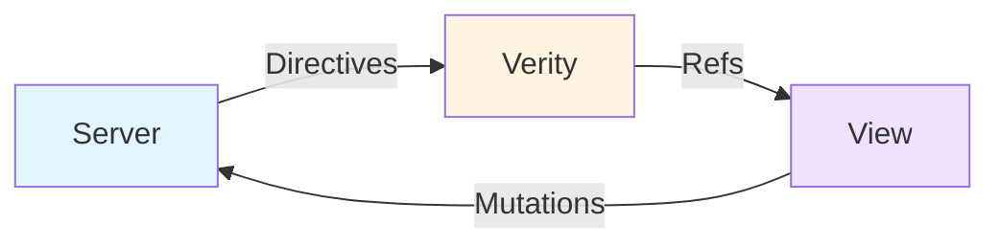

# Getting Started

This guide shows you how to integrate Verity into your application. We'll start with the mental model, then move to practical implementation.

---

## Understanding the Mental Model

!!! abstract "Start Here"
    Before writing code, understand these three foundational concepts.

### 1. Truth-State vs View-State

!!! tip "The Most Important Distinction"
    This is the key mental model that makes everything else make sense.

=== "Truth-State"
    **Verity Manages This**
    
    - Comes from the server
    - Multiple clients must agree on it
    - Examples: user profiles, order status, inventory
    - Cached, tracked, synchronized

=== "View-State"
    **Your Framework Manages This**
    
    - Local to one client
    - Examples: which menu is open, current tab, form drafts
    - Never leaves the browser

!!! warning "The Golden Rule"
    If it's on the server, it's truth-state. If it's only in the UI, it's view-state. **Never mix them.**

[Read the full guide →](../concepts/truth-vs-view-state.md){ .md-button }

### 2. The Three Layers



| Layer | Responsibility | What It Does |
|-------|---------------|--------------|
| **Server** | Domain logic | Owns truth-state, emits directives |
| **Verity** | Data layer | Fetches, caches, applies directives |
| **View** | Presentation | Renders, manages view-state |

[Understand the Architecture →](../architecture.md){ .md-button }

### 3. Directives Drive Updates

!!! info "Server-Authored Invalidation Contract"
    The server tells Verity what changed—not how to render it.

**A directive looks like this:**

```json hl_lines="2-4"
{
  "op": "refresh_item",  // (1)!
  "name": "todo",        // (2)!
  "id": 42               // (3)!
}
```

1. What operation: `refresh_item`, `refresh_collection`, or `invalidate`
2. Which type or collection
3. Which specific item (for `refresh_item`)

!!! success "Why Directives?"
    - Not DOM patches
    - Not field-level diffs
    - Just: "This thing changed, refetch it"
    - Decouples server from view structure

[Learn about Directives →](../concepts/directives.md){ .md-button }

---

## Installation

### Option 1: CDN (Recommended - No Build Tools)

```html
<!DOCTYPE html>
<html>
<head>
  <!-- Alpine.js -->
  <script defer src="https://cdn.jsdelivr.net/npm/alpinejs@3/dist/cdn.min.js"></script>
  
  <!-- Verity core -->
  <script src="https://cdn.jsdelivr.net/npm/verity-dl@latest/verity/shared/static/lib/core.js"></script>
  
  <!-- Verity Alpine adapter -->
  <script src="https://cdn.jsdelivr.net/npm/verity-dl@latest/verity/shared/static/adapters/alpine.js"></script>
</head>
<body>

<div id="app">
  <!-- Your app here -->
</div>

<script>
  // Setup (see below)
  // Access via window.Verity and window.VerityAlpine
</script>

</body>
</html>
```

**For production, use minified versions:**

```html
<script src="https://cdn.jsdelivr.net/npm/verity-dl@latest/verity/shared/static/lib/core.min.js"></script>
<script src="https://cdn.jsdelivr.net/npm/verity-dl@latest/verity/shared/static/adapters/alpine.min.js"></script>
```

### Option 2: npm (For Build Pipelines)

```bash
npm install verity-dl
```

```javascript
import { init, createType, createCollection } from 'verity-dl'
import { installAlpine } from 'verity-dl/adapters/alpine'
```

---

## Debugging with Devtools

!!! tip "Essential for Development"
    Install the devtools **before** you write any code. They're invaluable for understanding what Verity is doing.

**Add to your HTML (CDN):**

```html
<!-- Devtools CSS -->
<link rel="stylesheet" href="https://cdn.jsdelivr.net/npm/verity-dl@latest/verity/shared/static/devtools/devtools.css">

<!-- Devtools JS (load last, after Verity core) -->
<script src="https://cdn.jsdelivr.net/npm/verity-dl@latest/verity/shared/static/devtools/devtools.js"></script>
```

**Or npm:**

```javascript
import 'verity-dl/devtools/devtools.css'
import 'verity-dl/devtools/devtools.js'
```

**Usage:**
- **`Ctrl+Shift+V`** (or `Cmd+Shift+V` on Mac) to toggle devtools
- View live truth-state in the **Truth panel**
- Watch directive/fetch events in the **Events panel**
- Monitor SSE connection in the **SSE panel**

[Complete Devtools Guide →](../reference/devtools.md){ .md-button }

!!! warning "Development Only"
    Remove devtools from production builds. Use conditional loading based on `NODE_ENV` or hostname.

---

## Step 1: Initialize Verity

Initialize Verity's core data layer with configuration options.

```html
<script>
DL.init({
  // Optional configuration
  sse: {
    enabled: true,
    url: '/api/events',      // SSE endpoint for directives
    audience: 'global'        // or user-specific: `user-${userId}`
  },
  memory: {
    enabled: true,
    maxItemsPerType: 512,
    itemEntryTtlMs: 15 * 60 * 1000  // 15 minutes
  }
})
</script>
```

---

## Step 2: Register Collections (Truth-State)

Collections represent lists of item IDs from the server.

```javascript
DL.createCollection('todos', {
  fetch: async (params = {}) => {
    const url = new URL('/api/todos', location.origin)
    if (params.status) url.searchParams.set('status', params.status)
    
    const response = await fetch(url)
    const data = await response.json()
    
    // Must return { ids: [...], count: number }
    return {
      ids: data.ids,        // Array of todo IDs
      count: data.count     // Total count
    }
  },
  
  stalenessMs: 60_000  // Cache for 60 seconds
})
```

**Key points:**
- `fetch` returns **IDs only**, not full items
- Parameters enable filtering (e.g., `{ status: 'active' }`)
- Verity caches each parameter combination separately
- Use framework adapters to fetch full items from IDs

---

## Step 3: Register Types (Individual Items)

Types define how to fetch individual records by ID.

```javascript
DL.createType('todo', {
  // Fetch single item by ID
  fetch: async (id) => {
    const response = await fetch(`/api/todos/${id}`)
    return response.json()
  },
  
  // Optional: Bulk fetch for efficiency
  bulkFetch: async (ids, level = 'default') => {
    const response = await fetch('/api/todos/bulk', {
      method: 'POST',
      headers: { 'Content-Type': 'application/json' },
      body: JSON.stringify({ ids, level })
    })
    return response.json()  // Returns array of todos
  },
  
  // Optional: Additional detail levels
  levels: {
    simplified: {
      fetch: async (id) => {
        const response = await fetch(`/api/todos/${id}?level=simplified`)
        return response.json()
      },
      checkIfExists: (obj) => obj && obj.title != null
    },
    detailed: {
      fetch: async (id) => {
        const response = await fetch(`/api/todos/${id}?level=detailed`)
        return response.json()
      },
      checkIfExists: (obj) => obj && obj.description != null && obj.assignee != null
    }
  },
  
  stalenessMs: 5 * 60 * 1000  // Cache for 5 minutes
})
```

**About levels:**
- Use levels for progressive loading (simplified → detailed)
- Level conversion graphs minimize refetching
- [Learn more about Levels →](../concepts/levels-and-conversions.md)

---

## Step 4: Connect to Your Framework

### Alpine.js

```html
<head>
  <script defer src="https://cdn.jsdelivr.net/npm/alpinejs@3/dist/cdn.min.js"></script>
  <script src="https://cdn.jsdelivr.net/npm/verity-dl@latest/verity/shared/static/lib/core.min.js"></script>
  <script src="https://cdn.jsdelivr.net/npm/verity-dl@latest/verity/shared/static/adapters/alpine.min.js"></script>
</head>

<script>
// Initialize Verity
DL.init({
  sse: { url: '/api/events' }
})

// Register your data
DL.createCollection('todos', { /* ... */ })
DL.createType('todo', { /* ... */ })
</script>

<!-- Now use in templates via Alpine.store('lib') -->
<div x-data="todosPanel()">
  <template x-for="id in col().data.ids" :key="id">
    <div x-text="row(id).data?.title"></div>
  </template>
</div>

<script>
Alpine.data('todosPanel', () => ({
  col() {
    return Alpine.store('lib').col('todos', { params: { status: 'active' } })
  },
  row(id) {
    return Alpine.store('lib').it('todo', id, 'simplified', { silent: true })
  }
}))
</script>
```

### React

```javascript
import { useCollection, useItem } from 'verity-dl/adapters/react'

// Initialize once at app root
DL.init({ sse: { url: '/api/events' } })
DL.createCollection('todos', { /* ... */ })
DL.createType('todo', { /* ... */ })

// In components
function TodoList() {
  const colRef = useCollection('todos', { params: { status: 'active' } })
  
  if (colRef.meta.isLoading) return <p>Loading...</p>
  if (colRef.meta.error) return <p>Error: {colRef.meta.error.message}</p>
  
  return (
    <ul>
      {colRef.data.ids.map(id => (
        <TodoItem key={id} id={id} />
      ))}
    </ul>
  )
}

function TodoItem({ id }) {
  const itemRef = useItem('todo', id, 'simplified')
  
  if (!itemRef.data) return <li>Loading...</li>
  
  return <li>{itemRef.data.title}</li>
}
```

### Vue

```javascript
import { useDL } from 'verity-dl/adapters/vue'

// Initialize once at app root
DL.init({ sse: { url: '/api/events' } })
DL.createCollection('todos', { /* ... */ })
DL.createType('todo', { /* ... */ })

// In components
export default {
  setup() {
    const dl = useDL()
    const todosRef = dl.col('todos', { params: { status: 'active' } })
    
    return { todosRef }
  },
  template: `
    <div v-if="todosRef.meta.isLoading">Loading...</div>
    <ul v-else>
      <li v-for="id in todosRef.data.ids" :key="id">{{ id }}</li>
    </ul>
  `
}
```

---

## Step 5: Handle Mutations

### Frontend: Trigger Mutation + Apply Directives

```html
<script>
async function completeTodo(id) {
  // Show honest loading state
  isCompleting = true
  
  const response = await fetch(`/api/todos/${id}/complete`, {
    method: 'PUT',
    headers: {
      'X-Client-ID': registry.clientId  // Tag with client ID
    }
  })
  
  const payload = await response.json()
  
  // Apply directives from server
  if (payload.directives) {
    DL.applyDirectives(payload.directives)
  }
  
  isCompleting = false
}
</script>
```

### Backend: Return Directives

```python
# Python/Flask example
@app.put('/api/todos/<int:todo_id>/complete')
def complete_todo(todo_id):
    # 1. Update database
    todo = Todo.query.get_or_404(todo_id)
    todo.completed = True
    db.session.commit()
    
    # 2. Define directives
    directives = [
        {
            'op': 'refresh_item',
            'name': 'todo',
            'id': todo_id
        },
        {
            'op': 'refresh_collection',
            'name': 'todos'
        }
    ]
    
    # 3. Emit to SSE (for other clients)
    emit_directives(directives, source=request.headers.get('X-Client-ID'))
    
    # 4. Return to requesting client
    return {
        'todo': todo.to_dict(),
        'directives': directives
    }
```

**Key points:**
- Server decides what changed (it has the domain knowledge)
- Verity orchestrates refetching (it knows what's cached)
- SSE broadcasts keep other clients in sync automatically

---

## Complete Example: Todo App

### HTML

```html
<!DOCTYPE html>
<html>
<head>
  <!-- Alpine.js -->
  <script defer src="https://cdn.jsdelivr.net/npm/alpinejs@3/dist/cdn.min.js"></script>
  
  <!-- Verity -->
  <script src="https://cdn.jsdelivr.net/npm/verity-dl@latest/verity/shared/static/lib/core.min.js"></script>
  <script src="https://cdn.jsdelivr.net/npm/verity-dl@latest/verity/shared/static/adapters/alpine.min.js"></script>
</head>
<body>

<!-- TRUTH-STATE: Managed by Verity -->
<div x-data="{
  todos: $verity.collection('todos'),
  
  // VIEW-STATE: Managed by Alpine
  filter: 'all',
  isAdding: false,
  newTodoText: ''
}">
  
  <!-- Filter tabs (view-state) -->
  <div>
    <button @click="filter = 'all'" :class="{ active: filter === 'all' }">All</button>
    <button @click="filter = 'active'" :class="{ active: filter === 'active' }">Active</button>
    <button @click="filter = 'completed'" :class="{ active: filter === 'completed' }">Done</button>
  </div>
  
  <!-- Todo list (truth-state) -->
  <template x-if="todos.state.loading">
    <p>Loading...</p>
  </template>
  
  <ul>
    <template x-for="todo in todos.state.items" :key="todo.id">
      <li>
        <input type="checkbox" :checked="todo.completed" @change="toggleTodo(todo.id)">
        <span x-text="todo.title"></span>
      </li>
    </template>
  </ul>
</div>

<script>
DL.init()

DL.createCollection('todos', {
  fetch: () => fetch('/api/todos').then(r => r.json())
})

DL.createType('todo', {
  fetch: ({ id }) => fetch(`/api/todos/${id}`).then(r => r.json())
})

VerityAlpine.install(window.Alpine, { registry })

// Mutation helper
window.toggleTodo = async function(id) {
  const res = await fetch(`/api/todos/${id}/toggle`, {
    method: 'PUT',
    headers: { 'X-Client-ID': registry.clientId }
  })
  
  const { directives } = await res.json()
  DL.applyDirectives(directives)
}
</script>

</body>
</html>
```

---

## Common Patterns

### Pattern 1: Parameterized Collections

```javascript
// Register with parameter support
DL.createCollection('todos', {
  fetch: async (params = {}) => {
    const url = new URL('/api/todos', location.origin)
    if (params.status) url.searchParams.set('status', params.status)
    return fetch(url).then(r => r.json())
  }
})

// Use with parameters
<div x-data="{
  activeTodos: $verity.collection('todos', { status: 'active' }),
  completedTodos: $verity.collection('todos', { status: 'completed' })
}">
```

### Pattern 2: Silent Fetches for Lists

```html
<!-- Silent: no spinner, shows skeleton if no data -->
<template x-for="id in todoIds">
  <div x-data="{ todo: $verity.item('todo', id, null, { silent: true }) }">
    <template x-if="!todo.data">
      <div class="skeleton"></div>
    </template>
    <template x-if="todo.data">
      <span x-text="todo.data.title"></span>
    </template>
  </div>
</template>
```

### Pattern 3: Detail Levels

```javascript
// List view: default level (id, title, status)
const todo = DL.fetchItem('todo', 42)

// Detail view: detailed level (adds description, assignee, comments)
const todo = DL.fetchItem('todo', 42, 'detailed')
```

---

## Next Steps

**Core Concepts:**
- [Truth-State vs View-State](../concepts/truth-vs-view-state.md) - Master the key distinction
- [Directives](../concepts/directives.md) - Understand the invalidation contract
- [Levels & Conversions](../concepts/levels-and-conversions.md) - Optimize fetching

**Guides:**
- [State Model](state-model.md) - Deep dive on caching
- [UX Patterns](ux-patterns.md) - Honest loading states

**Examples:**
- [Browse Examples](../examples.md) - Full applications to study

**API Reference:**
- [Core API](../reference/core.md) - Complete API surface
- [Framework Adapters](../reference/adapters.md) - Alpine, React, Vue, Svelte
- [Devtools](../reference/devtools.md) - Visual debugging and inspection
