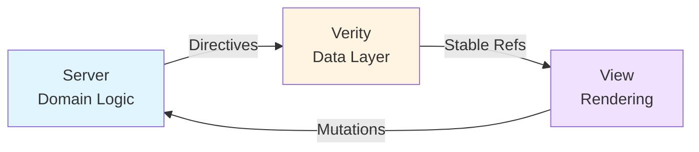

# Verity

> **One strong idea:** the server is the only source of truth.  
> **One clear boundary:** **truth-state** (server-owned) is not the same as **view-state** (client-owned).  
> **One purpose:** a composable data layer that mediates between them—protocol-agnostic, framework-agnostic, and honest.

Verity is **the backend of your frontend**. It sits between your server and view layer, handling caching, staleness, fan-out, and directive processing so your UI can focus purely on rendering.

> _If a piece of data cannot be proven, Verity keeps it in a loading state. Truth beats speed._

---

## The Problem

!!! danger "State Confusion in Modern Frontends"
    Most applications blur two fundamentally different kinds of state, creating bugs and user confusion.

Modern frontends mix:

=== "Truth-State"
    **Server-owned, authoritative data**
    
    - User profiles and account information
    - Order status and transaction history  
    - Inventory counts and product catalogs
    - Permissions and access control
    - Any data multiple clients must agree on

=== "View-State"
    **Client-owned, ephemeral UI concerns**
    
    - Which menu is open
    - Which row is expanded
    - Current tab selection
    - Form draft values (before submission)
    - Sidebar collapse state

!!! warning "The Result"
    Teams end up mixing "what the server says" with "what the UI is doing," then try to paper over races and stale views with **optimistic updates**. That creates flicker, mismatch, and user distrust.

---

## The Solution

!!! success "Verity Separates the Lanes"
    Clear boundaries between server, data layer, and view—each doing what it does best.



**The Three Layers:**

1. **Server** — Owns data integrity and business logic
2. **Verity (Backend of Frontend)** — Fetches, coalesces, tracks staleness, reacts to directives, exposes stable references
3. **View Layer** — Renders truth-state, manages view-state—**without** fetching, caching, or coordinating invalidation

!!! info "Not Just Conceptual"
    This separation shows up in Verity's public API, internal guarantees, and strict UX policy.

---

## Why Verity?

=== "Server Truth Only"
    !!! quote ""
        The UI changes **after** the server confirms change.
    
    - Unknowns render as **skeletons**
    - Work in progress shows **spinners**
    - No temporary lies
    - No speculation
    
    **Result:** Users trust what they see.

=== "Directive-Driven"
    !!! quote ""
        Servers emit **semantic directives** that describe what changed.
    
    ```json
    {
      "op": "refresh_item",
      "name": "todo",
      "id": 42
    }
    ```
    
    - Not DOM patches
    - Not field-level diffs
    - Just: "This thing changed"
    - Decouples server from view structure
    - Fan-out over SSE keeps all clients in sync

=== "Minimal Fetching"
    !!! quote ""
        One fetch can satisfy multiple detail levels.
    
    **Levels:** Different detail amounts for same entity
    
    - `summary` — id, name, status
    - `detailed` — adds description, assignee
    - `full` — adds comments, history
    
    **Conversion graphs:** Derive `summary` from `full` without refetch
    
    **Smart planning:** Directives trigger minimal refetches

=== "Framework-Agnostic"
    !!! quote ""
        Same core, different adapters.
    
    **Core:** Stable refs + subscribe API
    
    **Adapters:** Thin wrappers for:
    
    - :simple-alpinedotjs: Alpine.js
    - :simple-react: React
    - :simple-vuedotjs: Vue
    - :simple-svelte: Svelte
    
    **Benefit:** Switch frameworks, keep the data layer

=== "Honest by Design"
    !!! warning ""
        Perceived snappiness never justifies lying.
    
    **If you need instant feedback:**
    
    ✅ Make server respond faster  
    ✅ Show honest loading states  
    ✅ Use good skeletons/spinners  
    
    ❌ Don't fake it client-side

---

## What's Included

- **Flask Blueprint**: Exposes shared static assets (core library, adapters, devtools)
- **Framework-Agnostic JavaScript Core**: Enforces Verity's invariants (truth-only, latest-wins, coalescing)
- **Multiple Framework Adapters**: Bridge the core to Alpine, React, Vue, and Svelte with identical semantics
- **Realistic Examples**: Full-stack demos spanning finance, manufacturing, and telehealth domains
- **Devtools**: Lifecycle tracing, directive logs, cache inspection, and SSE monitoring

---

## Design Guarantees

- **Latest-wins**: stale network results won't clobber newer state
- **Coalesced**: identical in-flight requests reuse one promise
- **Deterministic**: the same sequence of directives + responses yields the same cache
- **Isolated**: truth-state doesn't leak view concerns; view-state doesn't influence server truth
- **Pluggable**: fetchers and directive sources are replaceable without touching views

---

## When to Use Verity

!!! tip "Use Verity for Truth-State"
    Where server truth matters—shared, audited, multi-client data.

=== "✅ Use Verity For"
    **Multi-client, server-owned data:**
    
    - User records and profiles
    - Order status and transactions
    - Inventory counts and catalogs
    - Permissions and access control
    - Audit logs and compliance data
    - Multi-user dashboards
    - Real-time operations centers
    - Any data where flicker erodes trust

=== "❌ Don't Use Verity For"
    **Local, client-owned UI state:**
    
    - Menu open/closed state
    - Current tab index
    - Form draft values (before submit)
    - UI animations and transitions
    - Sidebar collapse state
    - Dark mode preference (unless persisted server-side)

!!! question "The Smell Test"
    **If changing tabs or reloading should reset it:** view-state  
    **If a coworker on another device must see it:** truth-state

---

## Quick Start

!!! info "No Build Tools Required"
    Drop script tags in your HTML and start using Verity immediately.

=== "CDN (Recommended)"
    **Development:**
    
    ```html hl_lines="4-6"
    <head>
      <!-- Alpine.js -->
      <script defer src="https://cdn.jsdelivr.net/npm/alpinejs@3/dist/cdn.min.js"></script>
      
      <!-- Verity -->
      <script src="https://cdn.jsdelivr.net/npm/verity-dl@latest/verity/shared/static/lib/core.js"></script>
      <script src="https://cdn.jsdelivr.net/npm/verity-dl@latest/verity/shared/static/adapters/alpine.js"></script>
    </head>
    ```
    
    **Production (minified):**
    
    ```html hl_lines="2-3"
    <head>
      <script src="https://cdn.jsdelivr.net/npm/verity-dl@latest/verity/shared/static/lib/core.min.js"></script>
      <script src="https://cdn.jsdelivr.net/npm/verity-dl@latest/verity/shared/static/adapters/alpine.min.js"></script>
    </head>
    ```

=== "npm (Build Tools)"
    **Install:**
    
    ```bash
    npm install verity-dl
    ```
    
    **Import:**
    
    ```javascript
    import { init, createType, createCollection } from 'verity-dl/core'
    import { ensureAlpineStore } from 'verity-dl/adapters/alpine'
    ```

=== "React"
    ```html
    <script src="https://cdn.jsdelivr.net/npm/verity-dl@latest/verity/shared/static/lib/core.min.js"></script>
    <script src="https://cdn.jsdelivr.net/npm/verity-dl@latest/verity/shared/static/adapters/react.min.js"></script>
    ```

=== "Vue"
    ```html
    <script src="https://cdn.jsdelivr.net/npm/verity-dl@latest/verity/shared/static/lib/core.min.js"></script>
    <script src="https://cdn.jsdelivr.net/npm/verity-dl@latest/verity/shared/static/adapters/vue.min.js"></script>
    ```

### Complete Example (No Build Tools)

```html
<!DOCTYPE html>
<html>
<head>
  <!-- Alpine.js -->
  <script defer src="https://cdn.jsdelivr.net/npm/alpinejs@3/dist/cdn.min.js"></script>
  
  <!-- Verity -->
  <script src="https://cdn.jsdelivr.net/npm/verity-dl@latest/verity/shared/static/lib/core.js"></script>
  <script src="https://cdn.jsdelivr.net/npm/verity-dl@latest/verity/shared/static/adapters/alpine.js"></script>
</head>
<body>

<div x-data="verity.collection('todos')">
  <template x-if="state.loading">
    <p>Loading todos...</p>
  </template>
  
  <template x-for="todo in state.items" :key="todo.id">
    <div>
      <input type="checkbox" :checked="todo.completed">
      <span x-text="todo.title"></span>
    </div>
  </template>
</div>

<script>
  // Initialize Verity
  DL.init({
    sse: { url: '/api/events' }
  })
  
  // Register collections and types
  DL.createCollection('todos', {
    fetch: async (params) => {
      const res = await fetch('/api/todos')
      return res.json()  // { ids: [...], count: number }
    }
  })
  
  DL.createType('todo', {
    fetch: async (id) => {
      const res = await fetch(`/api/todos/${id}`)
      return res.json()
    }
  })
</script>

</body>
</html>
```

### Run Examples

The repository includes full-stack examples you can run locally:

```bash
# Clone the repository
git clone https://github.com/YidiDev/verity.git
cd verity

# Set up Python environment for examples
python -m venv .venv
source .venv/bin/activate
pip install -r requirements.txt

# Run an example
python verity/examples/invoices_alpine/app.py
# Or try: python verity/examples/manufacturing_monitor/app.py
```

---

## Learning Path

### 1. Understand the Foundation
- Read [Philosophy](philosophy.md) for the full mental model
- Study [Architecture](architecture.md) to see how the three layers interact
- Master [Truth-State vs View-State](concepts/truth-vs-view-state.md) distinction

### 2. Learn Core Concepts
- [Directives](concepts/directives.md) — the server-authored invalidation contract
- [Levels & Conversions](concepts/levels-and-conversions.md) — minimal fetching strategy
- [Concurrency Model](concepts/concurrency-model.md) — latest-wins, coalescing, and consistency

### 3. Get Building
- [Getting Started](guides/getting-started.md) — wire Verity into a new project
- [State Model](guides/state-model.md) — types, collections, and caching
- [UX Patterns](guides/ux-patterns.md) — honest loading states and user feedback

### 4. Go Deeper
- [API Reference](reference/core.md) — full API surface
- [Framework Adapters](reference/adapters.md) — Alpine, React, Vue, Svelte integration
- [Directive Reference](reference/directives.md) — complete directive contract

### 5. See It in Action
- [Examples Overview](examples.md) — production-scale demos
- Study baseline comparisons to see the difference

---

## How This Differs from Alternatives

=== "vs htmx/LiveView"
    !!! success "✅ What They Get Right"
        Server is the source of truth

    !!! failure "❌ What's Missing"
        - Server dictates DOM structure
        - Tight coupling backend ↔ view
        - Hard to support multiple clients
    
    !!! tip "Verity's Approach"
        - Pushes **data intent** (directives)
        - View-state stays client-owned
        - Same backend, any frontend

=== "vs TanStack Query/Apollo"
    !!! success "✅ What They Get Right"
        - Mature caching
        - Good tooling
        - Multi-framework support

    !!! failure "❌ What's Missing"
        - Optimistic updates encouraged
        - App-defined invalidation (glue code)
        - No level conversion planning
        - Server doesn't author contract
    
    !!! tip "Verity's Approach"
        - **Server** authors invalidation contract
        - No optimistic updates
        - Minimal refetch planning
        - Explicit truth-state boundary

=== "vs Roll-Your-Own"
    !!! success "✅ What You Get"
        Maximum control

    !!! failure "❌ What You Re-implement"
        - Coalescing
        - Latest-wins guards
        - Push integration
        - Multi-client convergence
        - UX semantics
        - Memory management
        - **Again. And again. And again.**
    
    !!! tip "Verity's Approach"
        The boring, correct default

!!! info "Detailed Comparison"
    See [Why Verity?](why-verity.md) for in-depth analysis.

---

## Community and Support

- **Documentation**: [verity.yidi.sh](https://verity.yidi.sh)
- **Source Code**: [github.com/YidiDev/verity](https://github.com/YidiDev/verity)
- **Issues**: [github.com/YidiDev/verity/issues](https://github.com/YidiDev/verity/issues)
- **Contributing**: See [CONTRIBUTING.md](../CONTRIBUTING.md)

---

## The Short Version

**Verity** treats the data layer as the **backend of your frontend**. It draws a hard line between **server truth** and **client view**, uses **directives** to keep them in sync, plans **minimal fetches** with **levels** and conversions, and refuses to lie to the user.

If that's the kind of correctness and clarity you want, this library is for you.
