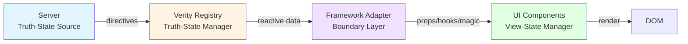

# Reference: Framework Adapters

> Complete API reference for Verity's framework integrations

Verity adapters are **thin bridges** between the core registry (which manages truth-state) and your UI framework (which manages view-state and rendering). They expose framework-idiomatic APIs while preserving Verity's philosophy.

!!! info "The Boundary"
    Adapters sit at the **truth-state ↔ view-state boundary**. They provide reactive access to truth-state without leaking data-layer concerns into your components.

---

## Philosophy: Two Lanes of State

Before diving into adapter APIs, remember the separation:



**Truth-State** (Verity's domain):
- Todos, users, orders, permissions
- Fetched from server
- Invalidated by directives
- Cached and coalesced

**View-State** (Component's domain):
- Which menu is open
- Which tab is selected
- Current filter UI state
- Form input values (before submission)

**Adapters expose truth-state. Components manage view-state.**

---

## Alpine.js

Browser-native adapter for Alpine.js. Perfect for HTML-first applications.

### Installation

```html
<!-- 1. Core -->
<script src="https://cdn.jsdelivr.net/npm/verity-dl@latest/verity/shared/static/lib/core.min.js"></script>

<!-- 2. Alpine -->
<script defer src="https://cdn.jsdelivr.net/npm/alpinejs@3/dist/cdn.min.js"></script>

<!-- 3. Verity Alpine Adapter -->
<script src="https://cdn.jsdelivr.net/npm/verity-dl@latest/verity/shared/static/adapters/alpine.min.js"></script>

<script>
  // Create registry
  const registry = Verity.createRegistry({
    sse: { url: '/api/events', audience: 'global' }
  })
  
  // Register types
  registry.registerCollection('todos', {
    fetch: async (params) => {
      const url = new URL('/api/todos', window.location.origin)
      if (params.status) url.searchParams.set('status', params.status)
      const res = await fetch(url)
      const data = await res.json()
      return { items: data.todos }
    }
  })
  
  // Install adapter
  VerityAlpine.install(registry)
</script>
```

### API

#### `VerityAlpine.install(registry, options?)`

Installs the Verity magic properties into Alpine.

```javascript
VerityAlpine.install(registry, {
  // Optional: custom registry name (default: '$verity')
  magicName: '$verity'
})
```

**Provides:**
- `$verity.item(name, params)` - Get item handle
- `$verity.collection(name, params)` - Get collection handle
- `$verity.applyDirectives(directives)` - Apply directives

### Usage

#### Basic Collection

```html
<div x-data="{ todos: $verity.collection('todos', { status: 'active' }) }">
  <!-- Loading state -->
  <template x-if="todos.state.loading">
    <div>Loading todos...</div>
  </template>
  
  <!-- Error state -->
  <template x-if="todos.state.error">
    <div x-text="'Error: ' + todos.state.error.message"></div>
  </template>
  
  <!-- Success state -->
  <template x-if="!todos.state.loading && !todos.state.error">
    <ul>
      <template x-for="todo in todos.state.items" :key="todo.id">
        <li>
          <span x-text="todo.title"></span>
          <button @click="toggleTodo(todo)">Toggle</button>
        </li>
      </template>
    </ul>
  </template>
</div>
```

#### With View-State

```html
<div x-data="{
  // Truth-state (from Verity)
  todos: $verity.collection('todos', { status: 'active' }),
  
  // View-state (local to component)
  selectedFilter: 'active',
  isMenuOpen: false,
  
  // Actions
  changeFilter(status) {
    this.selectedFilter = status
    this.todos.setParams({ status })  // Update Verity params
  },
  
  async toggleTodo(todo) {
    // Mutation
    const res = await fetch(`/api/todos/${todo.id}/toggle`, { method: 'PUT' })
    const data = await res.json()
    
    // Apply directives
    if (data.directives) {
      await $verity.applyDirectives(data.directives)
    }
  }
}">
  <!-- Filter tabs (view-state) -->
  <div>
    <button @click="changeFilter('active')" :class="{ 'active': selectedFilter === 'active' }">
      Active
    </button>
    <button @click="changeFilter('completed')" :class="{ 'active': selectedFilter === 'completed' }">
      Completed
    </button>
  </div>
  
  <!-- Todo list (truth-state) -->
  <ul>
    <template x-for="todo in todos.state.items" :key="todo.id">
      <li>
        <span x-text="todo.title"></span>
        <button @click="toggleTodo(todo)">Toggle</button>
      </li>
    </template>
  </ul>
</div>
```

#### Manual Refresh

```html
<div x-data="{ todos: $verity.collection('todos', {}) }">
  <button @click="todos.refresh()">Refresh</button>
  
  <ul>
    <template x-for="todo in todos.state.items" :key="todo.id">
      <li x-text="todo.title"></li>
    </template>
  </ul>
</div>
```

---

## React

Modern React adapter with hooks and context.

### Installation

```bash
npm install verity-dl
```

### Setup

```javascript
// App.jsx
import { createRegistry } from 'verity-dl/core'
import { VerityProvider } from 'verity-dl/adapters/react'

// Create registry
const registry = createRegistry({
  sse: { url: '/api/events', audience: 'global' }
})

// Register types
registry.registerCollection('todos', {
  fetch: async (params) => {
    const url = new URL('/api/todos', window.location.origin)
    if (params.status) url.searchParams.set('status', params.status)
    const res = await fetch(url)
    const data = await res.json()
    return { items: data.todos }
  }
})

function App() {
  return (
    <VerityProvider registry={registry}>
      <TodoList />
    </VerityProvider>
  )
}
```

### API

#### `useVerityCollection(name, params?)`

Hook that returns a reactive collection handle.

```typescript
function useVerityCollection(
  name: string,
  params?: any
): CollectionHandle
```

**Returns:**
```typescript
interface CollectionHandle {
  state: {
    loading: boolean
    error: Error | null
    items: any[]
    meta: any | null
  }
  refresh: () => Promise<void>
  setParams: (params: any) => void
}
```

#### `useVerityItem(name, params)`

Hook that returns a reactive item handle.

```typescript
function useVerityItem(
  name: string,
  params: any
): ItemHandle
```

**Returns:**
```typescript
interface ItemHandle {
  state: {
    loading: boolean
    error: Error | null
    value: any | null
  }
  refresh: () => Promise<void>
}
```

#### `useVerityRegistry()`

Access the registry directly.

```typescript
function useVerityRegistry(): Registry
```

### Usage

#### Basic Collection

```jsx
import { useVerityCollection } from 'verity-dl/adapters/react'

function TodoList() {
  const { state, refresh } = useVerityCollection('todos', { status: 'active' })
  
  if (state.loading) return <div>Loading...</div>
  if (state.error) return <div>Error: {state.error.message}</div>
  
  return (
    <div>
      <button onClick={refresh}>Refresh</button>
      <ul>
        {state.items.map(todo => (
          <li key={todo.id}>{todo.title}</li>
        ))}
      </ul>
    </div>
  )
}
```

#### With View-State

```jsx
import { useState } from 'react'
import { useVerityCollection, useVerityRegistry } from 'verity-dl/adapters/react'

function TodoList() {
  // Truth-state (from Verity)
  const { state, setParams } = useVerityCollection('todos', { status: 'active' })
  const registry = useVerityRegistry()
  
  // View-state (local to component)
  const [selectedFilter, setSelectedFilter] = useState('active')
  const [isMenuOpen, setIsMenuOpen] = useState(false)
  
  // Actions
  const changeFilter = (status) => {
    setSelectedFilter(status)  // Update view-state
    setParams({ status })       // Update truth-state params
  }
  
  const toggleTodo = async (todo) => {
    const res = await fetch(`/api/todos/${todo.id}/toggle`, { method: 'PUT' })
    const data = await res.json()
    
    if (data.directives) {
      await registry.applyDirectives(data.directives)
    }
  }
  
  return (
    <div>
      {/* Filter tabs (view-state) */}
      <div>
        <button
          onClick={() => changeFilter('active')}
          className={selectedFilter === 'active' ? 'active' : ''}
        >
          Active
        </button>
        <button
          onClick={() => changeFilter('completed')}
          className={selectedFilter === 'completed' ? 'active' : ''}
        >
          Completed
        </button>
      </div>
      
      {/* Todo list (truth-state) */}
      {state.loading && <div>Loading...</div>}
      {state.error && <div>Error: {state.error.message}</div>}
      {!state.loading && !state.error && (
        <ul>
          {state.items.map(todo => (
            <li key={todo.id}>
              <span>{todo.title}</span>
              <button onClick={() => toggleTodo(todo)}>Toggle</button>
            </li>
          ))}
        </ul>
      )}
    </div>
  )
}
```

#### Item Hook

```jsx
import { useVerityItem } from 'verity-dl/adapters/react'

function UserProfile({ userId }) {
  const { state, refresh } = useVerityItem('user', { userId })
  
  if (state.loading) return <div>Loading user...</div>
  if (state.error) return <div>Error: {state.error.message}</div>
  
  return (
    <div>
      <h1>{state.value.name}</h1>
      <p>{state.value.email}</p>
      <button onClick={refresh}>Refresh</button>
    </div>
  )
}
```

---

## Vue 3

Composition API adapter for Vue 3.

### Installation

```bash
npm install verity-dl
```

### Setup

```javascript
// main.js
import { createApp } from 'vue'
import { createRegistry } from 'verity-dl/core'
import { createVerityVuePlugin } from 'verity-dl/adapters/vue'
import App from './App.vue'

// Create registry
const registry = createRegistry({
  sse: { url: '/api/events', audience: 'global' }
})

// Register types
registry.registerCollection('todos', {
  fetch: async (params) => {
    const url = new URL('/api/todos', window.location.origin)
    if (params.status) url.searchParams.set('status', params.status)
    const res = await fetch(url)
    const data = await res.json()
    return { items: data.todos }
  }
})

// Create and install plugin
const app = createApp(App)
app.use(createVerityVuePlugin(registry))
app.mount('#app')
```

### API

#### `useVerityCollection(name, params?)`

Composition API hook for collections.

```typescript
function useVerityCollection(
  name: string,
  params?: Ref<any> | any
): ComputedRef<CollectionHandle>
```

**Note:** `params` can be a reactive ref or plain object.

#### `useVerityItem(name, params)`

Composition API hook for items.

```typescript
function useVerityItem(
  name: string,
  params: Ref<any> | any
): ComputedRef<ItemHandle>
```

#### `useVerityRegistry()`

Access the registry.

```typescript
function useVerityRegistry(): Registry
```

### Usage

#### Basic Collection

```vue
<script setup>
import { useVerityCollection } from 'verity-dl/adapters/vue'

const todos = useVerityCollection('todos', { status: 'active' })
</script>

<template>
  <div>
    <div v-if="todos.state.loading">Loading...</div>
    <div v-else-if="todos.state.error">Error: {{ todos.state.error.message }}</div>
    <ul v-else>
      <li v-for="todo in todos.state.items" :key="todo.id">
        {{ todo.title }}
      </li>
    </ul>
    <button @click="todos.refresh()">Refresh</button>
  </div>
</template>
```

#### With View-State

```vue
<script setup>
import { ref } from 'vue'
import { useVerityCollection, useVerityRegistry } from 'verity-dl/adapters/vue'

// Truth-state (from Verity)
const todos = useVerityCollection('todos', { status: 'active' })
const registry = useVerityRegistry()

// View-state (local to component)
const selectedFilter = ref('active')
const isMenuOpen = ref(false)

// Actions
const changeFilter = (status) => {
  selectedFilter.value = status
  todos.setParams({ status })
}

const toggleTodo = async (todo) => {
  const res = await fetch(`/api/todos/${todo.id}/toggle`, { method: 'PUT' })
  const data = await res.json()
  
  if (data.directives) {
    await registry.applyDirectives(data.directives)
  }
}
</script>

<template>
  <div>
    <!-- Filter tabs (view-state) -->
    <div>
      <button
        @click="changeFilter('active')"
        :class="{ active: selectedFilter === 'active' }"
      >
        Active
      </button>
      <button
        @click="changeFilter('completed')"
        :class="{ active: selectedFilter === 'completed' }"
      >
        Completed
      </button>
    </div>
    
    <!-- Todo list (truth-state) -->
    <div v-if="todos.state.loading">Loading...</div>
    <div v-else-if="todos.state.error">Error: {{ todos.state.error.message }}</div>
    <ul v-else>
      <li v-for="todo in todos.state.items" :key="todo.id">
        <span>{{ todo.title }}</span>
        <button @click="toggleTodo(todo)">Toggle</button>
      </li>
    </ul>
  </div>
</template>
```

#### Reactive Params

```vue
<script setup>
import { ref } from 'vue'
import { useVerityCollection } from 'verity-dl/adapters/vue'

// Reactive params
const statusFilter = ref('active')

// Collection automatically updates when params change
const todos = useVerityCollection('todos', { status: statusFilter })
</script>

<template>
  <div>
    <select v-model="statusFilter">
      <option value="active">Active</option>
      <option value="completed">Completed</option>
    </select>
    
    <ul>
      <li v-for="todo in todos.state.items" :key="todo.id">
        {{ todo.title }}
      </li>
    </ul>
  </div>
</template>
```

---

## Svelte

Store-based adapter for Svelte.

### Installation

```bash
npm install verity-dl
```

### Setup

```javascript
// stores.js
import { createRegistry } from 'verity-dl/core'

export const registry = createRegistry({
  sse: { url: '/api/events', audience: 'global' }
})

// Register types
registry.registerCollection('todos', {
  fetch: async (params) => {
    const url = new URL('/api/todos', window.location.origin)
    if (params.status) url.searchParams.set('status', params.status)
    const res = await fetch(url)
    const data = await res.json()
    return { items: data.todos }
  }
})
```

### API

#### `collectionStore(name, params?)`

Creates a Svelte store for a collection.

```typescript
function collectionStore(
  name: string,
  params?: any
): Readable<CollectionHandle>
```

#### `itemStore(name, params)`

Creates a Svelte store for an item.

```typescript
function itemStore(
  name: string,
  params: any
): Readable<ItemHandle>
```

### Usage

#### Basic Collection

```svelte
<script>
import { collectionStore } from 'verity-dl/adapters/svelte'

const todos = collectionStore('todos', { status: 'active' })
</script>

{#if $todos.state.loading}
  <div>Loading...</div>
{:else if $todos.state.error}
  <div>Error: {$todos.state.error.message}</div>
{:else}
  <ul>
    {#each $todos.state.items as todo (todo.id)}
      <li>{todo.title}</li>
    {/each}
  </ul>
{/if}

<button on:click={() => $todos.refresh()}>Refresh</button>
```

#### With View-State

```svelte
<script>
import { writable } from 'svelte/store'
import { collectionStore } from 'verity-dl/adapters/svelte'
import { registry } from './stores'

// Truth-state (from Verity)
const todos = collectionStore('todos', { status: 'active' })

// View-state (local to component)
const selectedFilter = writable('active')
const isMenuOpen = writable(false)

// Actions
function changeFilter(status) {
  selectedFilter.set(status)
  $todos.setParams({ status })
}

async function toggleTodo(todo) {
  const res = await fetch(`/api/todos/${todo.id}/toggle`, { method: 'PUT' })
  const data = await res.json()
  
  if (data.directives) {
    await registry.applyDirectives(data.directives)
  }
}
</script>

<!-- Filter tabs (view-state) -->
<div>
  <button
    on:click={() => changeFilter('active')}
    class:active={$selectedFilter === 'active'}
  >
    Active
  </button>
  <button
    on:click={() => changeFilter('completed')}
    class:active={$selectedFilter === 'completed'}
  >
    Completed
  </button>
</div>

<!-- Todo list (truth-state) -->
{#if $todos.state.loading}
  <div>Loading...</div>
{:else if $todos.state.error}
  <div>Error: {$todos.state.error.message}</div>
{:else}
  <ul>
    {#each $todos.state.items as todo (todo.id)}
      <li>
        <span>{todo.title}</span>
        <button on:click={() => toggleTodo(todo)}>Toggle</button>
      </li>
    {/each}
  </ul>
{/if}
```

---

## Common Patterns

### Pattern: Separating Truth-State and View-State

!!! success "Good: Clear Separation"
    ```javascript
    // React example
    function TodoList() {
      // Truth-state: managed by Verity
      const { state } = useVerityCollection('todos', { status: 'active' })
      
      // View-state: managed by component
      const [selectedId, setSelectedId] = useState(null)
      const [isDialogOpen, setIsDialogOpen] = useState(false)
      
      return (
        <div>
          <ul>
            {state.items.map(todo => (
              <li
                key={todo.id}
                onClick={() => setSelectedId(todo.id)}
                className={selectedId === todo.id ? 'selected' : ''}
              >
                {todo.title}
              </li>
            ))}
          </ul>
        </div>
      )
    }
    ```

!!! failure "Bad: Mixed Concerns"
    ```javascript
    // ❌ DON'T: Storing truth-state in local state
    function TodoList() {
      const { state } = useVerityCollection('todos', {})
      const [todos, setTodos] = useState([])  // ❌ Duplicate truth-state
      
      useEffect(() => {
        setTodos(state.items)  // ❌ Copying server data to local state
      }, [state.items])
      
      // Now you have two sources of truth!
    }
    ```

---

### Pattern: Mutations with Directive Application

```javascript
// React
const registry = useVerityRegistry()

const updateTodo = async (id, data) => {
  const res = await fetch(`/api/todos/${id}`, {
    method: 'PUT',
    headers: {
      'Content-Type': 'application/json',
      'X-Verity-Client-ID': registry.clientId
    },
    body: JSON.stringify(data)
  })
  
  const payload = await res.json()
  
  if (payload.directives) {
    await registry.applyDirectives(payload.directives)
  }
  
  return payload
}
```

---

### Pattern: Conditional Rendering Based on State

```jsx
// React
function DataView() {
  const { state } = useVerityCollection('items', {})
  
  return (
    <>
      {state.loading && <Skeleton />}
      {state.error && <ErrorMessage error={state.error} />}
      {!state.loading && !state.error && <ItemList items={state.items} />}
    </>
  )
}
```

---

## Summary

**Adapters Available:**

| Framework | Hook/API | Install Method |
|-----------|----------|----------------|
| Alpine.js | `$verity` magic | `VerityAlpine.install()` |
| React | `useVerityCollection()` | `<VerityProvider>` |
| Vue 3 | `useVerityCollection()` | `app.use(plugin)` |
| Svelte | `collectionStore()` | Direct import |

**Common APIs:**

| Method | Purpose |
|--------|---------|
| `collection(name, params)` | Get collection handle |
| `item(name, params)` | Get item handle |
| `state.loading` | Loading indicator |
| `state.error` | Error object |
| `state.items` | Collection data |
| `state.value` | Item data |
| `refresh()` | Manual refetch |
| `setParams()` | Update params |

**Key Principles:**

1. **Adapters manage truth-state access**
2. **Components manage view-state**
3. **Never duplicate truth-state in local state**
4. **Apply directives after mutations**
5. **Use framework-idiomatic patterns**

---

## Next Steps

- **Core API:** [Registry reference](core.md)
- **Directives:** [Directive contract](directives.md)
- **Devtools:** [Debugging with devtools](devtools.md)
- **Examples:** [Example applications](../examples.md)
